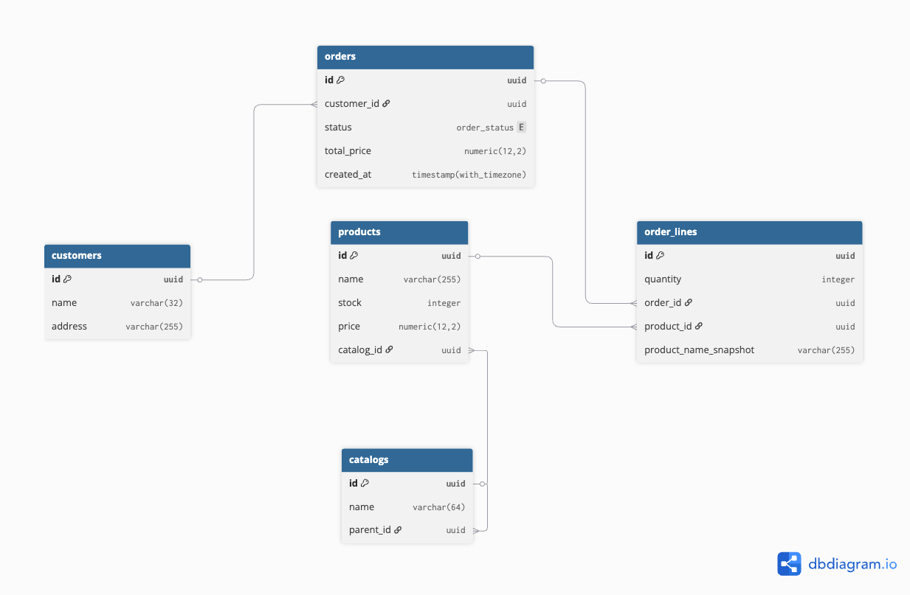

# Guru Test

## Запуск
1. Переименуйте файл с переменными окружения:
   ```bash
   mv ./config/local/.env.local ./config/local/.env
   ```
2. Установите переменную окружения:
   ```bash
   export APP_ENV=local
   ```
3. Запустите приложение:
   ```bash
   docker compose -f ./config/local/docker-compose.yml up -d --build
   ```

## Данные и SQL

- Тестовые данные и SQL‑запросы из пунктов 2.* находятся в `sql/`.
- Файл с тестовыми данными: `sql/insert_test_data.sql`.

Для вставки тестовых данных воспользуйтесь:
```bash
docker compose -f ./config/local/docker-compose.yml exec -T postgres psql -U postgres -d postgres < ./sql/insert_test_data.sql
```

## Документация

- План оптимизации БД: `docs/2_3_2_OPTIMIZATION.md`.

**Даталогическая схема БД:**


